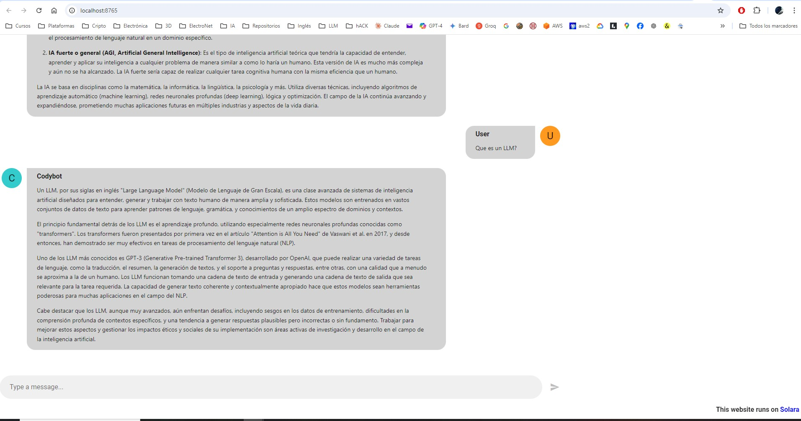
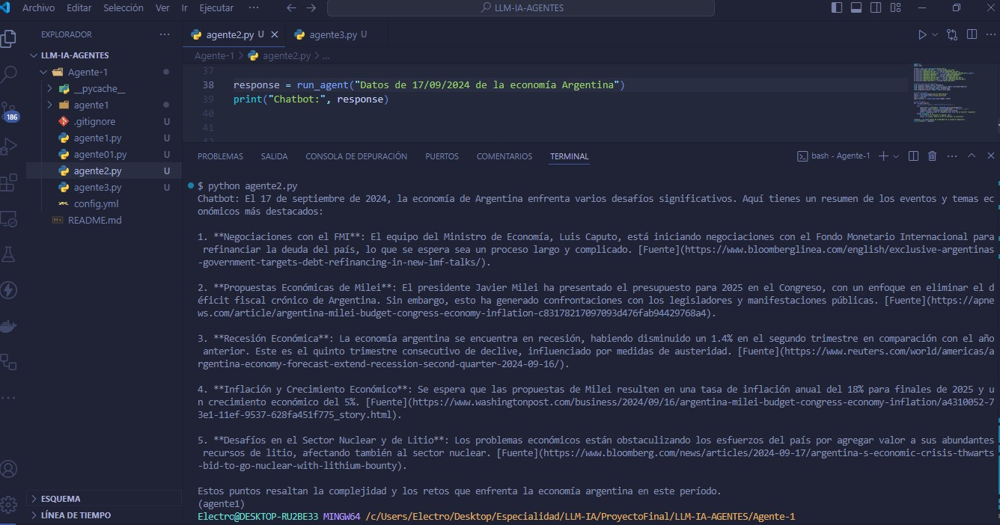
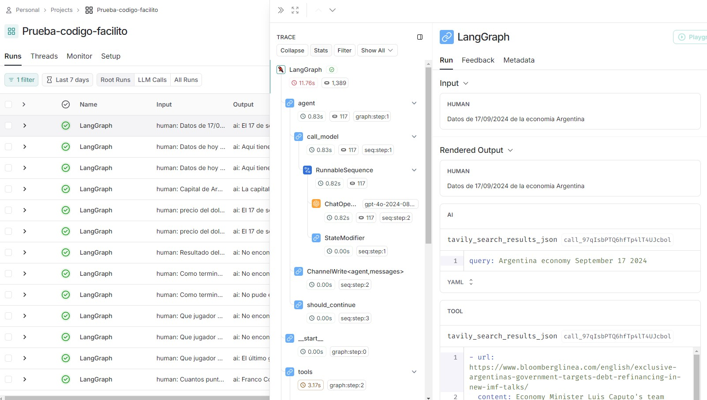

# Bootcamp de LLMs e IA

# Proyecto final

## Proyecto: Asistente Personal de "Segundo Cerebro" Basado en LLM

### Descripción:
El objetivo de este proyecto es desarrollar un asistente personal avanzado basado en LLM
que actúe como un "segundo cerebro" para el usuario.

#### El asistente consta de varios agentes especializados:
1. Agente de Diálogo: Responsable de mantener una conversación natural con el usuario,
entendiendo sus consultas, instrucciones y preferencias a través del procesamiento del lenguaje
natural.
2. Agente de Recuperación (RAG): Encargado de buscar y extraer información relevante de una
base de conocimientos personal del usuario, que incluye correos electrónicos, documentos, notas,
calendarios y fuentes externas curadas.
3. Agente de Organización: Responsable de organizar y estructurar la información recuperada,
creando conexiones y resúmenes para facilitar su acceso y comprensión.
4. Agente de Generación: Encargado de generar ideas, sugerencias y soluciones creativas basadas
en la información recuperada y las necesidades del usuario.
5. Agente de Personalización: Responsable de adaptar las respuestas y sugerencias del asistente
según las preferencias, el estilo de comunicación y los objetivos del usuario.

#### El asistente ofrecerá las siguientes funcionalidades principales:
1. Gestión de tareas y recordatorios.
2. Búsqueda y recuperación de información personal.
3. Generación de ideas y soluciones creativas.
4. Resumen y síntesis de información.
5. Planificación y programación de eventos.

## Agente 1

### Imagen del chatboot (CodyBot) con Solara

## Agente 2

### Imagen del Agente que ingresa información nueva de la web.

